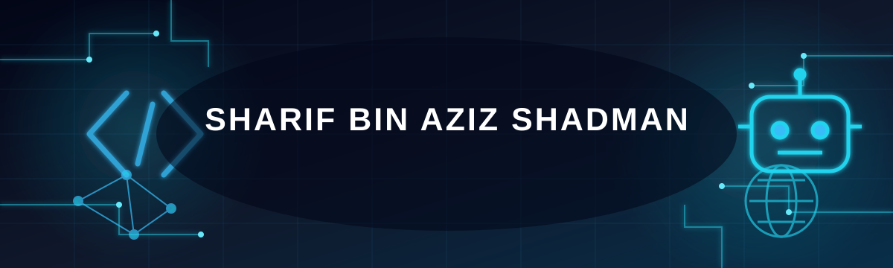

<p align="center">
  
</p>


🌱 **Learning • Building • Exploring • Improving**

</p>

---

## 👋 About Me

Hi! I'm **Sharif Bin Aziz Shadman**, a student who is interested in **technology and creative work**.

I enjoy making websites, learning through hands-on projects, photography, and exploring new experiences. I'm still learning and experimenting, and I try to improve a little with every project I build.

I'm not an expert — I'm simply someone who **enjoys learning, creating, and discovering new things**. 🚀

---

## 💻 What I Enjoy

```text
🌐 Building Websites
      ↓
🧪 Learning Through Projects
      ↓
📸 Photography
      ↓
💡 Exploring Technology
      ↓
🌱 Learning Something New
      ↓
🚀 Improving With Every Project
```

---

## 🛠️ Things I'm Learning

<p align="center">
  
</p>

I'm currently exploring web development and learning how different technologies work by building small projects and experimenting with ideas.

> 🌱 My skills are still growing, and that's part of the journey.

---


---

## 📸 Beyond Coding

Technology isn't the only thing I enjoy.

### 📷 Photography

Photography gives me a different way to be creative and notice details around me.

### 🌍 Exploring

I enjoy discovering new places, experiences, ideas, and technologies.

### 🧪 Experimenting

Sometimes the best way to learn something is simply to try it, make mistakes, and try again.

---


I'm still at the beginning of my journey, and I'm excited to see where it takes me.

---

## 🎯 What I'm Working Toward

I want to continue improving my skills, build more interesting projects, and learn more about technology and creative work.

For me, every project doesn't have to be perfect.

**It just needs to teach me something.** 🌱

---

## 💭 A Little Reminder

> **“You don't have to be an expert to start building.”**

I'm learning one project at a time, experimenting with new ideas, and enjoying the process.

---

## 🌟 Thanks for Visiting!

<p align="center">


**A student. A learner. A creator.**

🌱 Still learning
💻 Still building
📸 Still exploring
🚀 Still improving

</p>

<p align="center">
  
</p>

<p align="center">
  <sub>Made with curiosity, creativity & lots of learning.</sub>
</p>
