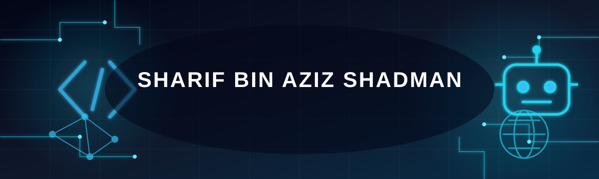

  

<h2 align="center">[ STUDENT — WEB · PHOTO · IOT · ROBOTICS ]</h2>

  

  
  
  

---

## About Me (shaspie)

Welcome! I am Sharif Bin Aziz Shadman, a curious technology and creative geek.

I love to make, code, learn something new everyday, take pictures and be experimental. I am a perpetual student who is always learning and trying to get better with every single project that I execute.

I am not an expert, I just really love to learn, tinker around and experiment with new things.

---

## 🌍 Live Projects

| | Project | Hosted On | Link |
| :---: | --- | --- | --- |
| 🧑‍💻 | **Personal Website** — my portfolio and journey |  | [sharifbinaziz.web.app](https://sharifbinaziz.web.app) |
| ✨ | **Shaspie** — live web project |  | [shaspie.vercel.app](https://shaspie.vercel.app/) |
| 🍞 | **Bagdad Bread Factory & Sweets** — business website with admin panel |  | [bagdadbreadfactory.shadmansharif.workers.dev](https://bagdadbreadfactory.shadmansharif.workers.dev/) |

---

## 🛠️ Use To Code

  
  
  
  
  
  
  
  
  

---

## ☁️ Tech I Work With

<table align="center">
  <tr>
    <td align="center" width="180">
       
      <b>Firebase</b> Database, authentication & hosting
    </td>
    <td align="center" width="180">
      <a href="https://github.com/">
        <picture>
          <source media="(prefers-color-scheme: dark)" srcset="https://cdn.simpleicons.org/github/FFFFFF">
          
        </picture>
      </a> 
      <b>GitHub</b> Version control & sharing my code
    </td>
    <td align="center" width="180">
       
      <b>Cloudflare</b> Deploying & speeding up websites
    </td>
    <td align="center" width="180">
      <a href="https://vercel.com/">
        <picture>
          <source media="(prefers-color-scheme: dark)" srcset="https://cdn.simpleicons.org/vercel/FFFFFF">
          
        </picture>
      </a> 
      <b>Vercel</b> Fast frontend hosting
    </td>
  </tr>
</table>

---

## 🌱 What I'm Into

<table align="center">
  <tr>
    <td align="center" width="200">🌐 <b>Building Websites</b> Clean, responsive sites</td>
    <td align="center" width="200">📸 <b>Photography</b> Telling stories through frames</td>
    <td align="center" width="200">🔌 <b>IoT</b> Connecting devices to the web</td>
    <td align="center" width="200">🤖 <b>Robotics</b> Servos, motors & Arduino</td>
  </tr>
</table>

📚 <b>Learning something new with every project</b>

---

## 📈 GitHub Stats

  
  

---

  <i>Still learning, still building. ✨</i>

  

